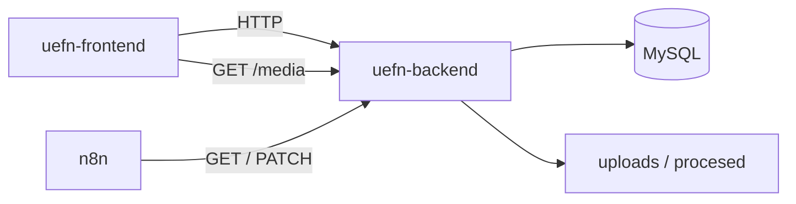
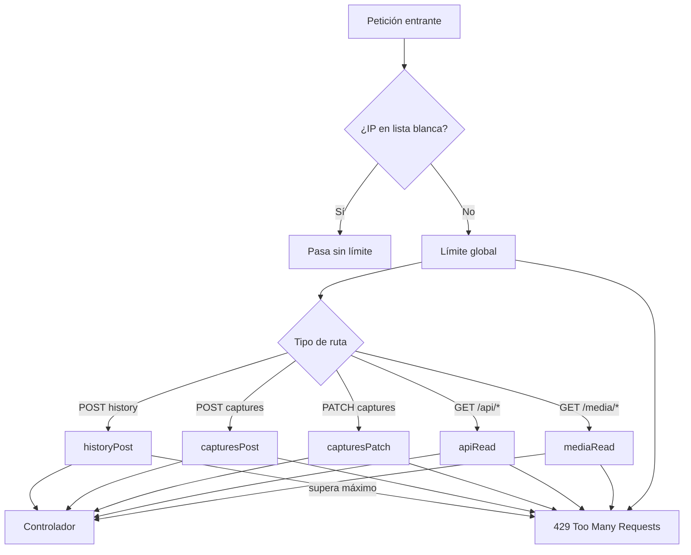
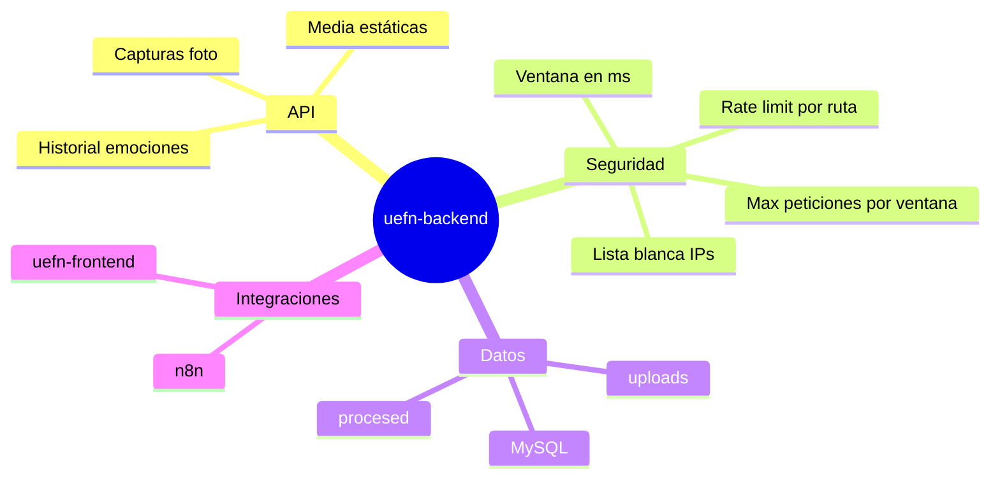

# MoodVision AI — Backend (`uefn-backend`)

Documento pensado para lectura **académica y clara**: qué hace esta API, cómo ejecutarla, qué rutas expone y cómo funciona la **protección anti-abuso** (límite de consultas por robots o uso excesivo).

---

## 1. Qué es este proyecto

|                       |                                                                                                                                     |
| --------------------- | ----------------------------------------------------------------------------------------------------------------------------------- |
| **Nombre**            | API REST de MoodVision AI                                                                                                           |
| **Tecnología**        | Node.js + Express + MySQL                                                                                                           |
| **Para qué sirve**    | Guardar **capturas de emoción** (foto + datos), **historial** en tiempo real, servir **imágenes** y alimentar el frontend y **n8n** |
| **Frontend asociado** | `uefn-frontend` (dashboard con cámara)                                                                                              |



---

## 2. Estructura del repositorio

```text
uefn-backend/
├── config/
│   └── apiSecurity.js      # Rate limiting (límites por ruta)
├── db/                     # Esquema y pool MySQL
├── routes/                 # captures, history, system
├── repositories/           # Consultas a la base de datos
├── utils/
│   ├── appTimezone.js      # Zona horaria de negocio (APP_TIMEZONE)
│   ├── dateFolders.js      # Reexporta carpetas YYYY-MM-DD
│   └── …                   # capturas, paginación, etc.
├── n8n/                    # Workflow para procesar fotos
├── index.js                # Arranque de Express
├── .env.example            # Variables de entorno de ejemplo
└── package.json
```

---

## 3. Cómo ejecutarlo

Necesitas **Node.js** (LTS) y **MySQL** con la base configurada en `.env`.

```bash
cd uefn-backend
cp .env.example .env    # edita usuario, contraseña y CORS
npm install
npm run db:init         # crea tablas si no existen
npm run dev             # desarrollo con recarga
# o
npm start               # producción local
```

Por defecto la API escucha en **`http://localhost:3006`** (variables `API_PORT` y `API_URL`).

Comprueba que responde:

```bash
curl http://localhost:3006/health
```

Respuesta esperada: `{ "ok": true, "service": "uefn-backend", "database": "connected" }`.

---

## 4. Rutas principales

| Método  | Ruta                            | Qué hace                                        |
| ------- | ------------------------------- | ----------------------------------------------- |
| `GET`   | `/health`                       | Estado de la API y MySQL                        |
| `POST`  | `/api/captures`                 | Sube foto + metadatos de emoción                |
| `GET`   | `/api/captures/processed`       | Lista para “Momentos divertidos”                |
| `GET`   | `/api/captures/new`             | Capturas pendientes (n8n)                       |
| `PATCH` | `/api/captures/:id/processed`   | Marca captura como procesada                    |
| `POST`  | `/api/history`                  | Registra emoción en historial (~1/s con cámara) |
| `GET`   | `/api/history/recent`           | Historial reciente                              |
| `GET`   | `/api/history/stats`            | Estadísticas agregadas                          |
| `GET`   | `/api/history/summary/today`    | Resumen del día                                 |
| `GET`   | `/api/history/today/by-emotion` | Conteos por emoción hoy                         |
| `GET`   | `/media/*`                      | Sirve imágenes de `uploads/` y `procesed/`      |

Más detalle del flujo n8n: carpeta [`n8n/README.md`](./n8n/README.md).

---

## 5. Seguridad: límite de consultas (rate limiting)

### 5.1 Por qué existe

Sin límite, un **robot** o un script podría:

- Enviar miles de `POST /api/history` y llenar MySQL.
- Subir fotos sin parar y llenar el disco.
- Hacer miles de `GET` y saturar el servidor.

La API usa la **opción B**: límites **distintos según el tipo de ruta**, porque el uso real de MoodVision no es igual en todas partes (el historial va ~**1 vez por segundo** con la cámara encendida; las fotos van mucho más despacio).

La lógica está en **`config/apiSecurity.js`**. Los números se leen del **`.env`**.

### 5.2 Unidades de tiempo (importante)

| Variable               | Unidad                     | Ejemplo | Significado                                                                           |
| ---------------------- | -------------------------- | ------- | ------------------------------------------------------------------------------------- |
| `RATE_LIMIT_WINDOW_MS` | **milisegundos**           | `60000` | Duración de la ventana = **1 minuto** (60 × 1000 ms)                                  |
| `RATE_LIMIT_*_MAX`     | **peticiones por ventana** | `100`   | Máximo **100 requests** en ese minuto (no “por segundo” salvo que cambies la ventana) |

**Regla práctica:** todos los contadores `*_MAX` cuentan peticiones **dentro de la misma ventana** definida por `RATE_LIMIT_WINDOW_MS`.

| `RATE_LIMIT_WINDOW_MS` | Ventana equivalente          |
| ---------------------- | ---------------------------- |
| `1000`                 | 1 segundo                    |
| `60000`                | 1 minuto (valor por defecto) |
| `3600000`              | 1 hora                       |

**Ejemplo con valores por defecto:**

- `RATE_LIMIT_HISTORY_POST_MAX=100` y `RATE_LIMIT_WINDOW_MS=60000`  
  → como máximo **100 POST** a `/api/history` **por IP cada 1 minuto**  
  → ≈ **1,6 peticiones por segundo** de media si se reparten en el minuto (el frontend legítimo usa ~**1 por segundo** = ~60/min, así que hay margen).

- `RATE_LIMIT_CAPTURES_POST_MAX=18`  
  → máximo **18 fotos por minuto** por IP (la captura automática suele ser cada **2,5 s o más**, es decir ~24/min en el peor caso teórico; 18 es un techo seguro).

### 5.3 Cómo se aplica (capas)



- **`/health`** no cuenta para el límite global (monitoreo libre).
- Si se supera un límite, la API responde **429** con JSON:

```json
{
  "ok": false,
  "error": "Demasiados registros de historial. Reduce la frecuencia o espera.",
  "retryAfter": 60
}
```

`retryAfter` está en **segundos** (tiempo sugerido de espera ≈ duración de la ventana).

Las cabeceras HTTP `RateLimit-*` también informan al cliente (estándar de `express-rate-limit`).

### 5.4 Tabla de variables `.env`

Copia la sección desde `.env.example`. Cada fila indica **unidad** y **ruta afectada**.

| Variable                        | Unidad del valor       | Default         | Ruta / uso                                                   |
| ------------------------------- | ---------------------- | --------------- | ------------------------------------------------------------ |
| `RATE_LIMIT_ENABLED`            | `true` / `false`       | `true`          | Activa o desactiva **todos** los límites                     |
| `RATE_LIMIT_TRUST_PROXY`        | `true` / `false`       | `true`          | Si hay **nginx** delante, usa la IP real (`X-Forwarded-For`) |
| `RATE_LIMIT_WINDOW_MS`          | **milisegundos**       | `60000` (1 min) | Ventana común para todos los contadores                      |
| `RATE_LIMIT_WHITELIST_IPS`      | IPs separadas por coma | `127.0.0.1,::1` | Sin límite (p. ej. **n8n** en el mismo servidor)             |
| `RATE_LIMIT_GLOBAL_MAX`         | peticiones / ventana   | `200`           | Techo total por IP (casi todas las rutas)                    |
| `RATE_LIMIT_HISTORY_POST_MAX`   | peticiones / ventana   | `100`           | `POST /api/history`                                          |
| `RATE_LIMIT_CAPTURES_POST_MAX`  | peticiones / ventana   | `18`            | `POST /api/captures`                                         |
| `RATE_LIMIT_CAPTURES_PATCH_MAX` | peticiones / ventana   | `60`            | `PATCH /api/captures/:id/processed`                          |
| `RATE_LIMIT_API_GET_MAX`        | peticiones / ventana   | `120`           | `GET` en `/api/history` y `/api/captures`                    |
| `RATE_LIMIT_MEDIA_GET_MAX`      | peticiones / ventana   | `240`           | `GET /media/*` (muchas miniaturas)                           |

### 5.5 Uso real del frontend vs límites

| Acción del usuario                      | Frecuencia aproximada                                                   | Variable que la protege                           |
| --------------------------------------- | ----------------------------------------------------------------------- | ------------------------------------------------- |
| Cámara activa → historial               | **~1 POST / segundo** → **~60 / minuto**                                | `RATE_LIMIT_HISTORY_POST_MAX` (100/min da margen) |
| Captura automática de foto              | cada **≥ 2,5 s** (configurable en frontend) → **≤ ~24 / min** en teoría | `RATE_LIMIT_CAPTURES_POST_MAX` (18/min)           |
| Abrir modales (estadísticas, historial) | ráfagas de **GET**                                                      | `RATE_LIMIT_API_GET_MAX`                          |
| Galería “Momentos divertidos”           | muchas imágenes **GET /media**                                          | `RATE_LIMIT_MEDIA_GET_MAX`                        |
| n8n procesa capturas                    | **PATCH** repetidos                                                     | `RATE_LIMIT_CAPTURES_PATCH_MAX` + whitelist IP    |

### 5.6 Ajustes habituales

| Situación                                              | Qué hacer                                                                     |
| ------------------------------------------------------ | ----------------------------------------------------------------------------- |
| Desarrollo local y quieres probar sin 429              | `RATE_LIMIT_ENABLED=false`                                                    |
| API detrás de nginx en producción                      | `RATE_LIMIT_TRUST_PROXY=true`                                                 |
| n8n en el mismo droplet                                | Añade su IP a `RATE_LIMIT_WHITELIST_IPS` o deja `127.0.0.1`                   |
| Varios alumnos en la **misma WiFi** (misma IP pública) | Sube `RATE_LIMIT_HISTORY_POST_MAX` (ej. `150`–`180`)                          |
| Quieres límite “por segundo” en vez de por minuto      | `RATE_LIMIT_WINDOW_MS=1000` y baja los `*_MAX` (ej. historial `2` = 2 POST/s) |

Al arrancar, la consola muestra un resumen:

```text
[apiSecurity] Rate limit activo — ventana 60000ms | global=200 historyPOST=100 ...
```

### 5.7 Conversión rápida (chuleta)

Para ventana de **1 minuto** (`RATE_LIMIT_WINDOW_MS=60000`):

| Si quieres permitir en promedio… | Pon en `*_MAX` aprox. |
| -------------------------------- | --------------------- |
| 1 petición / segundo             | `60`                  |
| 2 peticiones / segundo           | `120`                 |
| 1 petición cada 2 segundos       | `30`                  |
| 1 petición cada 2,5 segundos     | `24`                  |

Fórmula:  
`peticiones_por_minuto ≈ 60 / segundos_entre_cada_petición`

---

## 6. Fechas y zona horaria (opción 1)

| Concepto            | Dónde                                        | Convención                                                                      |
| ------------------- | -------------------------------------------- | ------------------------------------------------------------------------------- |
| **Instante exacto** | `fecha_captura` (DATETIME)                   | Componentes **UTC** (ej. 23:51 del 23 may cuando en Sídney son las 9:51 del 24) |
| **Día de negocio**  | `capture_calendar_day` + carpetas `uploads/` | **YYYY-MM-DD** en `APP_TIMEZONE` (por defecto `Australia/Sydney`)               |
| **Historial “hoy”** | `GET /api/history/...?date=`                 | Rango UTC del día calendario en Sídney                                          |

```env
APP_TIMEZONE=Australia/Sydney
```

Utilidades compartidas en `utils/appTimezone.js`:

- `calendarDayInAppTz(iso)` — día calendario en Sídney
- `toMysqlDatetimeUtc(iso)` — guardar instante en UTC
- `dayBoundsUtc('2026-05-24')` — inicio/fin del día para filtros SQL
- `resolveAppCalendarDay(date)` — “hoy” o validar `?date=`

Al arrancar, el servidor imprime: `App timezone (día de negocio): Australia/Sydney`.

Tras actualizar, ejecuta `npm run db:init` una vez para añadir `capture_calendar_day` y el índice único nuevo.

---

## 7. Otras variables de entorno

| Variable                          | Descripción                                        |
| --------------------------------- | -------------------------------------------------- |
| `API_PORT`                        | Puerto HTTP (ej. `3006`)                           |
| `API_URL`                         | URL pública base (sin puerto si va en proxy)       |
| `APP_TIMEZONE`                    | Zona IANA para “hoy” y una captura por emoción/día |
| `CORS_ORIGINS`                    | Orígenes del frontend permitidos (coma separada)   |
| `DB_*`                            | Conexión MySQL                                     |
| `UPLOADS_DIR` / `PROCESSED_DIR`   | Carpetas de imágenes                               |
| `NEW_ESTADO` / `PROCESSED_ESTADO` | Estados de procesamiento de capturas               |

---

## 8. Despliegue

En producción, incluye **todas** las variables de rate limit en el `.env` del servidor (o en el secret de GitHub Actions `UEFN_BACKEND_ENV` si usas CI/CD).

Si solo actualizas el código pero no el `.env` del servidor, se aplican los **valores por defecto** definidos en `config/apiSecurity.js`.

---

## 8. Resumen visual



---

## 10. Contexto académico

Backend del proyecto de grado **MoodVision AI** (reconocimiento emocional y experiencias interactivas), desarrollado para **Domenica Miranda** — [Acertijo.dev](https://acertijo.dev).
